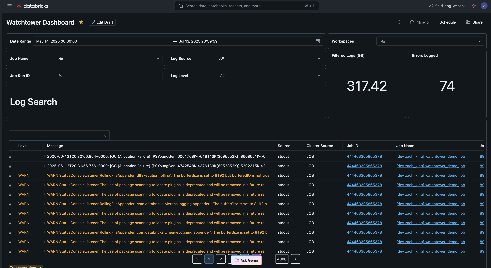
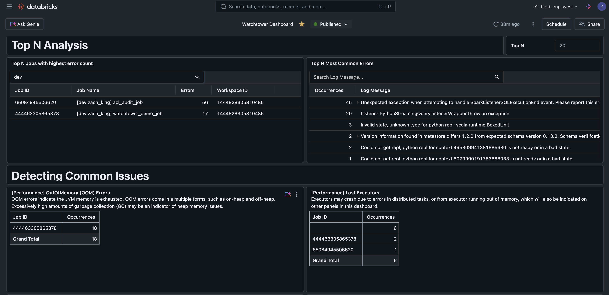

# Watchtower - Databricks Logging Solution

A solution accelerator to standardizing, centralizing, and ingesting Databricks cluster logs
for enhanced log searching, troubleshooting, and optimization.

The goal of this repo is to provide platform administrators and data engineers a reference implementation
for scalable log ingestion, as well as broader guidance for practitioners to use logging in jobs.

The included dashboard automatically detects common Spark issues without requiring manual log analysis. It provides pre-built pattern detectors for performance problems (OutOfMemory errors, spill to disk, lost executors) and privacy concerns (df.show() statements in logs), alongside flexible log search and Top N analysis capabilities. This allows you to quickly identify and troubleshoot job failures by surfacing the most relevant issues in an easily visible way.





## Prerequisites

Before deploying this solution, ensure you have:

- **Unity Catalog**: A catalog named `watchtower` must be created in your workspace (or provide your own catalog name by modifying the `catalog` variable in `databricks.yml`)
- **SQL Warehouse**: A SQL warehouse must be available and referenced in `databricks.yml` (default: "Shared Unity Catalog Serverless")

## Getting started

1. Install the Databricks CLI from https://docs.databricks.com/dev-tools/cli/install.html

2. Authenticate to your Databricks workspace (if you have not done so already):
    ```
    $ databricks configure
    ```

3. To deploy a development copy of this project, type:
    ```
    $ databricks bundle deploy --target dev
    ```
    (Note that "dev" is the default target, so the `--target` parameter
    is optional here.)

    This deploys everything that's defined for this project.
    For example, the default template would deploy a Lakeflow Pipeline called
    `[dev yourname] watchtower_pipeline` to your workspace.
    You can find that pipeline by opening your workpace and clicking on **Jobs & Pipelines**.

4. Similarly, to deploy a production copy, configure a `prod` target in [databricks.yml](./databricks.yml) and type:
   ```
   $ databricks bundle deploy --target prod
   ```

5. To deploy and run integration tests:
   ```
   $ databricks bundle deploy --target staging
   $ databricks bundle run integration_tests --target staging
   ```

6. To run a job, use the "run" command:
   ```
   $ databricks bundle run [KEY]
   ```

7. Optionally, install developer tools such as the Databricks extension for Visual Studio Code from
   https://docs.databricks.com/dev-tools/vscode-ext.html.

8. For documentation on the Databricks Asset Bundles format used
   for this project, and for CI/CD configuration, see
   https://docs.databricks.com/dev-tools/bundles/index.html.

### Teardown and Cleanup

To completely tear down all resources that were deploeyd as part of this asset bundle:  

```shell
databricks bundle destroy --target dev
```

If you also used the provided Terraform to deploy your Unity Catalog Volume resources,
you can tear those down as well:  

```shell
cd terraform && terraform destroy && cd ..
```

### Linting and Code Analysis

To run the linter by itself:  

```shell
hatch run lint:check
```

To run the linter with automatic fixing (when possible):  

```shell
hatch run lint:fix
```

Run all static analysis tools with one command:  

```shell
hatch run analyze:all
```

### Run Tests

To run unit tests:  

```shell
hatch run test:test
```

## CI/CD Setup (Optional)

To enable automatic testing on Pull Requests:

1. **Add GitHub Repository Secrets**:
   - Go to your repo → Settings → Secrets and variables → Actions
   - Add secret: `DATABRICKS_TOKEN` (your Databricks token)
   - Optionally add variable: `DATABRICKS_HOST`

2. **What happens automatically**:
   - **Pull Requests**: Validated and tested with isolated workspace paths
   - **Main branch**: Deployed to your dev environment
   - **PR cleanup**: Resources automatically cleaned up when PR is closed

## What Gets Deployed

- **Pipeline**: `Databricks log ingestion pipeline` 
- **Workflow**: `watchtower_demo_job`
- **Dashboard**: `Logs Dashboard` (deployed alongside pipeline) - includes log search with filtering, Top N analysis for errors and jobs, and pre-built detectors for common issues like OOM errors, spill to disk, lost executors, and privacy concerns
- **Location**: `/Workspace/Users/your-email@company.com/.bundle/watchtower/`

## Manual Commands (if you prefer)

```bash
cd terraform && terraform init && terraform apply && cd .. # Deploy Catalog resources and init scripts
databricks bundle validate    # Check configuration
databricks bundle deploy      # Deploy to workspace
databricks bundle run demo_workflow # Run the demo workflow
databricks bundle summary     # See what's deployed
databricks bundle destroy     # Remove everything
cd terraform && terraform destroy && cd ..
```

## Raw Log File Retention

Watchtower automatically manages the cleanup of processed raw log files using Databricks autoloader's cleanSource feature. This helps control storage costs and meet data retention compliance requirements.

### Configuration Options

You can customize the retention behavior using these variables in `databricks.yml`:

- **`raw_log_retention_action`** (default: `DELETE`)
  - Valid values: `DELETE`, `MOVE`, `OFF`
  - `DELETE`: Permanently removes processed files after the retention period
  - `MOVE`: Archives processed files to a cold storage location
  - `OFF`: Disables automatic cleanup (files are never deleted)

- **`raw_log_retention_duration`** (default: `30 days`)
  - How long to retain raw log files before cleanup
  - Format: `<number> <unit>` (e.g., `7 days`, `90 days`, `1 month`)

- **`raw_log_retention_move_destination`** (default: `""`)
  - Destination path when using `MOVE` action
  - Leave empty when using `DELETE` action
  - Example: `/Volumes/watchtower/default/archived_logs/`

### Example Configurations

**Keep logs for 7 days, then delete:**
```yaml
variables:
  raw_log_retention_action: DELETE
  raw_log_retention_duration: 7 days
```

**Archive logs to cold storage after 90 days:**
```yaml
variables:
  raw_log_retention_action: MOVE
  raw_log_retention_duration: 90 days
  raw_log_retention_move_destination: /Volumes/watchtower/default/archived_logs/
```

**Disable automatic cleanup:**
```yaml
variables:
  raw_log_retention_action: OFF
```

> **Note**: This feature was highlighted in the [Databricks blog on scalable logging](https://www.databricks.com/blog/practitioners-ultimate-guide-scalable-logging) under Operational Considerations. While you can also implement retention using cloud provider lifecycle rules (S3/ADLS/GCS), this built-in approach is simpler and doesn't require additional cloud configuration.

## Customizing for Your Project

1. Update `databricks.yml` or the `resources/*.yml` files with your job/pipeline settings
2. Modify `src/watchtower/log_ingest_pipeline.py` to customize the log ingestion pipeline
3. Modify the workspace `host` and `root_path` as needed
4. Modify `terraform/main.tf` as needed, or create a `terraform/.auto.tfvars` file to override Terraform variables.
